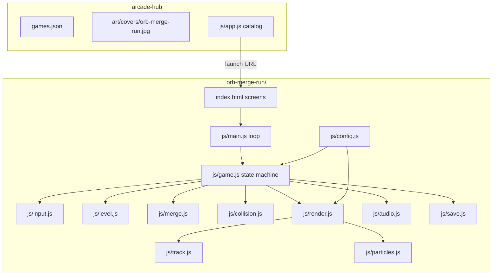
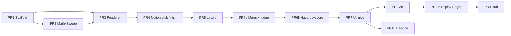

# Orb Merge Run — Design Document

| Field | Value |
|-------|--------|
| **Title** | Orb Merge Run — Full Game + Arcade Hub Integration |
| **Author** | — |
| **Date** | 2026-07-26 |
| **Status** | Draft (rev 3 — post re-review consistency fixes) |
| **Suggested repo** | `orb-merge-run` |
| **Live URL (planned)** | `https://jmitchell238.github.io/orb-merge-run/` |
| **Genre reference** | Ball Run 2048: merge number (KAYAC) — original name/branding **not** used |
| **Closest monorepo peers** | `crowd-runner/` (pseudo-3D + steer), `drop-and-fuse/` (orbs, PWA, tests) |
| **Secondary peer** | `cozy-racers/` — portrait stage / speed-curve tuning only (top-down 2D, not a render peer) |

---

## Overview

**Orb Merge Run** is a portrait-first, casual runner-merge game for the Arcade Hub. The player controls a numbered ball that auto-scrolls along a raised rail/track. Swipe or drag steers left/right. Stationary numbered orbs litter the course: hitting one with the **same value** merges (values add as powers of two: 2→4→…→2048+), grows the ball, and shifts its candy color. Thorns demote the player's value; falling off the rail or into a pit restarts the run. Reaching the goal **on-rail** awards coins scaled by finish value and unlocks the next level.

Implementation follows monorepo conventions: static HTML/JS/CSS (no build step), Canvas 2D with **pseudo-3D perspective projection** adapted from `crowd-runner/js/renderer.js`, merge tier tables and juice from `drop-and-fuse/`, PWA shell + `GAME_VERSION` probing as in `arcade-hub/README.md`.

**Quality bar (v1):** a full **genre-loop** clone at **hub polish** quality — readable pseudo-3D track and glossy numbered orbs competitive with other Arcade Hub titles (Crowd Clash Runner, Drop & Fuse), **not** visual parity with commercial Unity/3D store builds. Target 60 fps on mid-range phones.

---

## Background & Motivation

### Why this game

- The hub has a strong **runner** (`crowd-runner`) and a strong **merge** title (`drop-and-fuse`), but not the hybrid “run + merge numbered balls” genre.
- Players who enjoy Crowd Clash Runner will recognize steer-and-scroll feel; Drop & Fuse players will recognize tier colors, merge pop, and number-ladder satisfaction.
- The genre is well-scoped for a no-build Canvas game: one player entity, simple collision primitives, segment-based levels, high juice payoff.

### Current state

| Peer | Reusable pieces | Do **not** copy blindly |
|------|-----------------|-------------------------|
| `crowd-runner/` | `project(wx,wy,wz)`, road strips/edge stripes/center dashes, drag steer, Z progression, spike **draw** language, finish checkerboard, shake/floatText/particles, lobby/coins patterns | **Hard-clamps** `targetX` to road (we must **not** — fall skill); pits are **crowd-damage** (`frac` 0.30), not instant death; unseeded `Math.random` level gen; shop/skins meta |
| `drop-and-fuse/` | Tier candy colors, glossy orb draw, merge SFX, particle pop, `GAME_VERSION` + SW CACHE sync, `tests/run.mjs` vm harness, classic script tags, save key style | Orbs use names not numerals on small tiers — **we always draw large numbers** |
| `arcade-hub/` | `games.json` fields, cover art, SW ASSETS + CACHE bump, live `GAME_VERSION` probe | — |
| `cozy-racers/` | Portrait logical stage, speed curves | Screen-space top-down road (`ROAD_W = 210` px), not world pseudo-3D |

### Do-not-copy callout (implementers)

```
┌─────────────────────────────────────────────────────────────────┐
│  DO NOT COPY FROM crowd-runner WITHOUT READING THIS:            │
│  • No targetX hard-clamp to rail — oversteer = fall skill       │
│  • Pits are LETHAL (instant death), not crowd-damage fracs      │
│  • No shop / skins / rebirth meta in v1                         │
│  • Levels are SEEDed segment templates — never Math.random()    │
│    in buildLevel; use rng(seed) only                            │
│  • SW template = drop-and-fuse/sw.js (not crowd-runner CACHE)   │
└─────────────────────────────────────────────────────────────────┘
```

### Pain points this design avoids

- **Three.js/WebGL for v1** — breaks zero-build monorepo pattern and complicates iOS Safari offline PWAs.
- **Trademark collision** — no “Ball Run 2048”, KAYAC marks, or store screenshot clones.
- **Scope creep** (skins shop, endless mode, multiplayer) — deferred past v1.

---

## Goals & Non-Goals

### Goals (v1)

1. Complete playable **genre-loop** clone: steer, merge same numbers, grow, avoid thorns/fall-off/pits, reach goal on-rail, earn coins, unlock levels.
2. **Hub polish visual quality**: pseudo-3D Canvas with glossy numbered spheres, candy palette, curb extrusion, ground shadows, merge juice — meeting the [Visual Acceptance Checklist](#visual-acceptance-checklist-v1) below. Not commercial 3D parity.
3. Portrait-primary mobile UX; landscape letterboxed; keyboard support for desktop.
4. 60 fps target on mid-range phones (iPhone 11 / mid Android 2020+ class).
5. PWA installable shell; offline after first visit.
6. Hub integration: cover, `games.json` entry, SW asset list, version discoverable as `GAME_VERSION`.
7. Node-runnable unit tests for pure logic (merge, **swept** collision, level gen, scoring, resolution order).
8. First-run tutorial + accessible large numerals on every ball.

### Non-Goals (v1)

- True WebGL / Three.js / custom shaders (optional post-v1 spike only if checklist fails in playtest).
- External music tracks or licensed audio assets.
- In-app purchases, ads, accounts, leaderboards, cloud save.
- Ball skin shop / cosmetic economy (config hooks OK; no UI).
- Online multiplayer or async challenges / daily seed.
- Hand-crafted 50+ unique level art — v1 uses **seeded procedural segments**.
- Perfect geometric parity with any commercial title’s level layouts.
- Physics engine (Box2D etc.) — swept circle / strip tests only.
- Visual parity with Unity 3D commercial “Ball Run” titles.

---

## Key Decisions

| # | Decision | Choice | Rationale |
|---|----------|--------|-----------|
| K1 | **Game name** | **Orb Merge Run** (`orb-merge-run`) | Family-friendly, genre-clear, no trademark collision. |
| K2 | **Renderer** | **Canvas 2D pseudo-3D** (adapted crowd-runner `project()`) | Zero deps; hub-proven; 60 fps. True 3D deferred. |
| K3 | **Stage aspect** | Flexible **9:16** stage (crowd-runner portrait path wins default); landscape 16:9 letterbox; DPR cap 2 | Mobile-first; full phone height. |
| K4 | **Merge rule** | Same power-of-two value only → `a+b`. Chain merges max **4** steps/frame. Resolution order: [Frame resolution order](#frame-resolution-order). Values **≥ 4096 allowed**; color stays rainbow + sparkle intensity scales. | Genre expectation; post-2048 locked open (closed Q1). |
| K5 | **Wrong-number collision** | Soft pass: player **x/z/speed unchanged**; orb nudged laterally by fixed Δx; `ghostUntil = t + GHOST_S` (0.15s). Ghost orbs still **render solid**, skip collision. | Flow over hard physics. |
| K6 | **Thorn/spike** | Demote one tier via `Math.floor(v/2)`, min 2. Invuln `THORN_INVULN = 0.4s`. **Single-trigger per strip per run** (`consumed = true` after a successful hit — never clears when leaving the strip). Invuln only prevents hitting a *different* strip until it expires. | Clear + recoverable; matches crowd-runner `done` semantics. |
| K7 | **Death** | Fall off rail **or** pit support failure → immediate fail. **Bank 0 mid-run coins** (only goal awards). Prior banked coins keep. | Genre fail state; stricter than crowd-runner lose. |
| K8 | **Level content** | **Seeded segment templates** (20 templates) + packing algorithm; 12 levels. **Inspired by** crowd-runner `buildLevel(L)` density curves; **adds** templates + seed (crowd-runner is unseeded random plan — do not expect template system there). | Fair retries; tunable. |
| K9 | **Scoring** | `coinsForFinish(L, value, merges)` with **`coinMult = 1`** fixed in v1 (no shop). | No undefined multiplier. |
| K10 | **Modules** | Classic script tags (drop-and-fuse style). Tests load via Node `vm` bundle. | SW simplicity; no import maps. |
| K11 | **Audio** | WebAudio synth only; mute in save. | Zero asset weight. |
| K12 | **Meta for v1** | Linear unlock, coins, mute, bests, GFX flag. **No shop.** | Scope control. |
| K13 | **Finish condition** | Win only if `player.z >= finishZ` **and** player is on support (not off-rail, not in pit) **and** state is still `play`. If off-rail/pit triggers in same frame as finish, **death wins** (checked before finish). | Fair “cross the line on the track.” |
| K14 | **World units** | `TRACK_W = 10`, `TRACK_HALF = 5`, curb height `0.45`, fixed fall margin (see constants). Same scale family as crowd-runner `ROAD_W = 10`. | Implementable numbers. |
| K15 | **Input model** | **Relative pointer drag** (delta → `targetX`) + keyboard hold. **No** hard clamp on `targetX`. Thumbstick non-goal v1. | Precision on rails without absolute jump. |
| K16 | **Collision reliability** | **Swept** segment–circle tests are **v1 core** (PR 2 + PR 6a), not a stretch PR. Hit radius = draw radius + `HIT_PAD`. | High risk must ship with gameplay. |
| K17 | **Level count** | **12 levels** for v1. | Enough progression without content bloat. |
| K18 | **Hub featured** | `"featured": false` until product says otherwise. | Catalog tests require exactly one featured game. |

---

## Proposed Design

### High-level architecture



### World constants (authoritative)

All lengths in **world units** unless noted. Mirror crowd-runner scale (`ROAD_W = 10`).

```js
// js/config.js — WORLD / TRACK
const TRACK_W     = 10;
const TRACK_HALF  = TRACK_W / 2;          // 5
const CURB_H      = 0.45;                 // visual curb height
const CURB_INSET  = 0.35;                 // white edge stripe width (visual)
// Fall: FIXED curb margin (does NOT grow with ball radius — large balls stay skillful)
const FALL_MARGIN = 0.25;                 // die when |x| > TRACK_HALF + FALL_MARGIN
// Warning band (visual only)
const WARN_FRAC   = 0.85;                 // warn when |x| > TRACK_HALF * WARN_FRAC

// Ball radius
const BASE_R   = 0.50;
const GROW     = 1.12;
const MAX_R    = TRACK_W * 0.70 / 2;      // 3.5 — never > 70% of full track width as diameter
const HIT_PAD  = 0.12;                    // collision radius = drawR + HIT_PAD
const DRAW_R_OF = (v) => radiusForValue(v); // see merge.js
const HIT_R_OF  = (v) => DRAW_R_OF(v) + HIT_PAD;

// Motion
const STEER_LERP   = 12;
const STEER_SPEED  = 9;                   // keyboard world-units/sec toward targetX
const WORLD_PER_PX = (cssW) => 14 / Math.min(cssW || 390, 900); // adapted from crowd-runner
const MERGE_BOOST  = 1.06;                // speed mult after merge
const MERGE_BOOST_T = 0.35;

// Merge / ghost
const GHOST_S      = 0.15;
const NUDGE_X      = 0.55;                // world units lateral push on wrong-hit
const MAX_CHAIN    = 4;
const MERGE_SLOP   = 1.0;                 // swept uses exact sum of hit radii (pad already in HIT_R)

// Thorns
const THORN_INVULN = 0.4;
const THORN_DEPTH  = 1.2;                 // default strip length along z if template omits

// Level length
const BASE_LEN  = 160;                    // finishZ base for L=1 before padding
const LEN_STEP  = 22;                     // extra length per level
const FINISH_PAD = 8;                     // clear run-in before finish gate
// finishZ(L) = BASE_LEN + (L-1)*LEN_STEP + FINISH_PAD

// Camera (adapted from crowd-runner: PITCH 0.46, cam y=8.5, z=-14 — NOT identical)
const PITCH = 0.42;
// cam.x = lerp toward player.x * 0.35; cam.y = 7.2; cam.z = player.z - 12

// Timing
const DEAD_ANIM_S = 0.6;
```

#### Radius table (draw radius; hit = draw + 0.12)

| Value | Tier idx `i` (0-based from 2) | Draw R | Hit R | Diameter / TRACK_W |
|------:|------------------------------:|-------:|------:|-------------------:|
| 2 | 0 | 0.500 | 0.620 | 10% |
| 4 | 1 | 0.560 | 0.680 | 11% |
| 8 | 2 | 0.627 | 0.747 | 13% |
| 16 | 3 | 0.702 | 0.822 | 14% |
| 32 | 4 | 0.787 | 0.907 | 16% |
| 64 | 5 | 0.881 | 1.001 | 18% |
| 128 | 6 | 0.987 | 1.107 | 20% |
| 256 | 7 | 1.105 | 1.225 | 22% |
| 512 | 8 | 1.238 | 1.358 | 25% |
| 1024 | 9 | 1.386 | 1.506 | 28% |
| 2048 | 10 | 1.553 | 1.673 | 31% |
| 4096 | 11 | 1.739 | 1.859 | 35% |
| 8192 | 12 | 1.948 | 2.068 | 39% |
| … | … | min(MAX_R=3.5, …) | … | cap 70% diameter |

**Fall margin policy:** `FALL_MARGIN = 0.25` is **fixed** (does not scale with radius). Large balls are slightly harder to keep entirely on the deck visually but death uses center-x only — intentional: skill remains about steering center, not growing a free pass. Thorn dodging gets harder as hit radius grows (intentional trade-off for power).

### Coordinate system

| Axis | Meaning |
|------|---------|
| **x** | Lateral; 0 = track center; default rail edges at `±TRACK_HALF` (may narrow per segment) |
| **y** | Up; road surface y=0; ball center at y = drawR |
| **z** | Forward; player auto-increases z; camera trails behind |

```js
// Adapted structure (not identical constants) from crowd-runner/js/renderer.js
function project(wx, wy, wz) {
  const dx = wx - cam.x, dy = wy - cam.y, dz = wz - cam.z;
  const zc = -dy * sinP + dz * cosP;
  if (zc < 0.5) return null;
  const yc = dy * cosP + dz * sinP;
  const s = F / zc;
  return [CX + dx * s, CY - yc * s, s];
}
```

### Runtime loop (sequence)

```mermaid
sequenceDiagram
  participant I as input.js
  participant G as game.js
  participant C as collision.js
  participant M as merge.js
  participant R as render.js

  loop every frame
    I->>G: targetX deltas / keys
    G->>G: invuln timers; x lerp; store z0
    G->>G: z1 = z0 + speed*dt
    G->>C: resolveFrame(player, z0, z1, orbs, hazards)
    Note over C,G: order: merges → wrong nudge → thorns → pit/rail death → finish
    G->>R: draw
  end
```

### Frame resolution order

Authoritative order inside `resolveFrame` after motion integration to `z1` (x is lerped at start of frame; sweep uses constant x for the z segment — good enough; optional mid-frame x is non-goal):

1. **Collect orb contacts** via swept test from `(x, z0)` → `(x, z1)` against each non-consumed, non-ghost orb in z-window.
2. **Sort contacts** by contact distance along segment ascending (earliest hit first); tie-break smaller `|orb.x - player.x|`.
3. **Same-value merges** (up to `MAX_CHAIN` chain steps): **after each successful merge, re-scan all non-consumed, non-ghost orbs** with `sweptCircleHit(..., HIT_R_OF(player.value), ...)` using the **updated** value/radius — do **not** only re-check the initial contacts list (radius growth can bring new orbs into range). Pick earliest hit by sweep `t` among same-value hits; consume orb; repeat until no same-value hit or `merges === MAX_CHAIN`.
4. **Wrong-value contacts**: re-scan (or filter the last scan) for remaining overlapping different-value orbs; apply `softNudge` once per orb; set `ghostUntil`; player x/z/speed **unchanged**.
5. **Thorn strips:** swept/point-in-strip for any non-consumed thorn; if hit and `invuln <= 0`, demote, set invuln, set thorn `consumed = true` (see thorn model).
6. **Pit / rail death:** if not on support at `z1` with final `x` → `die()`. **Death checked before finish.**
7. **Finish:** if alive and `z1 >= finishZ` and on support → `completeLevel()`.
8. Commit `player.z = z1`.

If death and finish would both qualify, **death wins** (K13).

---

### Gameplay systems (detail)

#### Player entity

```js
{
  x: 0, targetX: 0, z: 0,
  value: 2,
  radius: 0.50,          // draw radius (updated on merge/demote)
  speed: 8.5,
  invuln: 0,
  ghostIgnore: false,    // N/A for player
  squash: 1, expandT: 0, rollAngle: 0,
  mergeBoostT: 0,
}
```

**Start value:** always `2`.

#### Steering model (K15)

| Input | Behavior |
|-------|----------|
| **Pointer drag** | Relative: `targetX += (clientX - lastX) * WORLD_PER_PX(cssW)`. No hard clamp. |
| **Keyboard** | Hold ←/A or →/D: `targetX ± STEER_SPEED * dt` |
| **Thumbstick** | Non-goal v1 |

```js
player.x = lerp(player.x, player.targetX, Math.min(1, dt * STEER_LERP));
// DO NOT clamp targetX to ±TRACK_HALF (unlike crowd-runner)
```

Edge warning when `|player.x| > TRACK_HALF * WARN_FRAC` (visual curb glow only).

#### Forward speed

```js
function levelSpeed(L) {
  return Math.min(8.5 + (L - 1) * 0.45, 16);
}
// effective = levelSpeed * (mergeBoostT > 0 ? MERGE_BOOST : 1)
```

| Level | Speed (u/s) | Δz @ 60fps | Δz @ 30fps |
|------:|------------:|-----------:|-----------:|
| 1 | 8.5 | 0.142 | 0.283 |
| 5 | 10.3 | 0.172 | 0.343 |
| 12 | 13.45 | 0.224 | 0.448 |
| cap | 16 | 0.267 | 0.533 |

At 30 fps / 16 u/s, step ≈ 0.53 units — **must** sweep (orb diameter at tier 2 ≈ 1.0; tunneling is real without sweep).

#### Merge rules & pure math

```js
// merge.js
function isPowerOfTwo(v) {
  return Number.isInteger(v) && v >= 2 && (v & (v - 1)) === 0;
}

/** @returns {number|null} next value or null if no merge */
function nextValue(a, b) {
  if (a !== b) return null;
  if (!isPowerOfTwo(a) || !isPowerOfTwo(b)) return null;
  return a + b; // === 2*a for powers of two
}

function demoteValue(v) {
  if (v <= 2) return 2;
  return Math.floor(v / 2); // integer policy; for pure powers of two == v/2
}

/** 0-based index in TIERS for v=2,4,...,2048; ≥4096 → use last + overflow */
function tierForValue(v) {
  if (!isPowerOfTwo(v) || v < 2) return 0;
  const i = Math.round(Math.log2(v)) - 1; // 2→0, 4→1, 2048→10
  return Math.max(0, i);
}

function valueForTier(i) {
  return 2 ** (i + 1);
}

function colorForValue(v) {
  if (v >= 2048) return { color: 'rainbow', glow: '#ffffff' };
  const t = TIERS[Math.min(tierForValue(v), TIERS.length - 1)];
  return t;
}

function radiusForValue(v) {
  const i = Math.max(0, Math.log2(Math.max(2, v)) - 1);
  return Math.min(MAX_R, BASE_R * Math.pow(GROW, i));
}
```

| Event | Rule |
|-------|------|
| Same value (swept contact) | `player.value = nextValue(...)`; consume orb; juice; optional chain |
| Different value | `softNudge`; ghost; no player motion change |
| Chain | After each merge, **full re-scan** of all non-consumed orbs with new radius/value (not frozen first-pass contacts); max `MAX_CHAIN` |
| Post-2048 | **Allowed** (4096, 8192, …); always rainbow; sparkle rate scales with `log2(v)` |

#### Swept collision (v1 core — K16)

Discrete end-of-frame circles are **insufficient**. Use **segment–circle** distance in the XZ plane (y ignored for hits).

```js
// collision.js — pure

/**
 * Distance from point C to segment AB, and whether the infinite-line
 * projection falls within the segment (clamped).
 * Returns { dist2, t } where t in [0,1] is param along AB.
 */
function dist2PointSegment(cx, cz, ax, az, bx, bz) {
  const abx = bx - ax, abz = bz - az;
  const acx = cx - ax, acz = cz - az;
  const ab2 = abx * abx + abz * abz;
  let t = ab2 < 1e-12 ? 0 : (acx * abx + acz * abz) / ab2;
  t = Math.max(0, Math.min(1, t));
  const px = ax + abx * t, pz = az + abz * t;
  const dx = cx - px, dz = cz - pz;
  return { dist2: dx * dx + dz * dz, t, px, pz };
}

/**
 * Swept player circle along (x,z0)→(x,z1) vs static orb circle.
 * hitR = playerHitR + orbHitR (already includes HIT_PAD each, or pad once — we pad each).
 */
function sweptCircleHit(px, z0, z1, pHitR, ox, oz, oHitR) {
  const sumR = pHitR + oHitR;
  const { dist2, t } = dist2PointSegment(ox, oz, px, z0, px, z1);
  return dist2 <= sumR * sumR ? { hit: true, t, dist2 } : { hit: false, t, dist2 };
}

/** Static (non-swept) helper for tests / rest checks */
function circleHit(ax, az, ar, bx, bz, br) {
  const dx = ax - bx, dz = az - bz;
  const r = ar + br;
  return dx * dx + dz * dz <= r * r;
}
```

**Unit tests required (PR 2):**

| Test | Expect |
|------|--------|
| Player at z=0, orb at z=0.15, speed 16, dt=1/30 (step 0.533) — end pos past orb | **hit true** (would miss discrete end-only if radii small) |
| Player path far left, orb far right | hit false |
| Exact grazing `dist == sumR` | hit true |
| `dt = 1/20` worst-case hitch | still hits orb on centerline |
| Chain: two same-value orbs stacked in z | both merge within one frame if within chain budget (full re-scan after first merge, not frozen contacts) |
| Chain: third orb only in range after radius grows | still merges on re-scan when hit radii expand |
| hasSupport mid-pit opening | false; z just outside [z0,z1] on-rail → true |

**Active set:** orbs with `oz` in `[min(z0,z1) - maxR*2, max(z0,z1) + maxR*2]` only.

#### Wrong-number soft pass / nudge (K5)

```js
const GHOST_S = 0.15;
const NUDGE_X = 0.55;

/**
 * Player motion unchanged. Orb pushed away laterally; becomes non-solid.
 * Ghost orbs still RENDER solid (full opacity); only collision skipped while t < ghostUntil.
 * If already ghost, skip (no re-nudge loop).
 */
/**
 * @param {{ tieDir?: 1|-1 }} [opts] — override lateral tie-break (tests).
 * No Math.random: same seed + same play stays deterministic.
 */
function softNudge(player, orb, now, opts = {}) {
  if (orb.ghostUntil > now) return;
  let dir = Math.sign(orb.x - player.x);
  if (dir === 0) {
    // Prefer steer intent, then fixed +1 (never Math.random on gameplay path)
    dir = opts.tieDir
      || Math.sign(player.targetX - player.x)
      || 1;
  }
  orb.x += dir * NUDGE_X;
  // Optional visual clamp: orb.x = clamp(orb.x, -TRACK_HALF*1.2, TRACK_HALF*1.2)
  orb.ghostUntil = now + GHOST_S;
}

// After ghost expires, orb is solid again. If player still overlapping, next frame
// will nudge again once — acceptable; NUDGE_X and player forward motion usually clear.
// No player.x change. No speed change. No bounce.
```

**Multi-contact:** after all merges resolved, every remaining wrong-value contact in the contact list gets at most one nudge this frame (dedupe by orb id).

#### Thorn / spike model (single-trigger)

```js
// Hazard record
{
  type: 'thorn',
  x0, x1,           // lateral strip [x0, x1]
  z,                // leading edge
  depth: THORN_DEPTH, // extent along +z → occupies [z, z+depth]
  consumed: false,  // single-trigger for this strip
}

/**
 * Player circle (at x, z along sweep) vs axis-aligned strip in XZ.
 * Treat player as point expanded by pHitR: expand strip by pHitR.
 */
function stripHit(px, pz, pHitR, x0, x1, z0, depth) {
  const z1 = z0 + depth;
  const inZ = pz >= (z0 - pHitR) && pz <= (z1 + pHitR);
  const inX = px >= (x0 - pHitR) && px <= (x1 + pHitR);
  return inX && inZ;
}

// Swept thorn: sample or segment vs expanded AABB — implement as
// stripHit at z0 OR z1 OR if segment crosses strip z-range while x overlaps.
function sweptStripHit(px, zA, zB, pHitR, thorn) {
  const lo = Math.min(zA, zB), hi = Math.max(zA, zB);
  const t0 = thorn.z - pHitR, t1 = thorn.z + thorn.depth + pHitR;
  if (hi < t0 || lo > t1) return false;
  return px >= (thorn.x0 - pHitR) && px <= (thorn.x1 + pHitR);
}
```

**On hit** (step 5 of resolution), if `!thorn.consumed && player.invuln <= 0`:

1. `player.value = demoteValue(player.value)`; update radius.
2. `player.invuln = THORN_INVULN`.
3. `thorn.consumed = true` — **no continuous damage** while overlapping.
4. Shake, float text, hurt SFX. At value 2, still play feel, value stays 2.

**Re-entry:** once `consumed`, strip never hurts again this run (like crowd-runner hazard `done`). No “wait for invuln to expire and re-hit same strip.” New strips further down the track each have their own `consumed` flag.

**Visual:** candy red/pink triangles — language of `crowd-runner/js/hazards.js` `drawSpikes`, not the damage semantics.

#### Pit / rail death geometry

**Rail death:**

```js
function isOffRail(x, trackHalf = TRACK_HALF) {
  return Math.abs(x) > trackHalf + FALL_MARGIN;
}
// Uses FIXED FALL_MARGIN — not radius-scaled.
```

**Pit record:**

```js
{
  type: 'pit',
  x0, x1,     // opening in lateral coords (gap where there is NO support)
  z0, z1,     // along-track extent of the gap
}
```

**Support rule** at position `(x, z)` given active track half `H` (may be narrowed by segment) and pits:

```js
function hasSupport(x, z, trackHalf, pits) {
  if (isOffRail(x, trackHalf)) return false;
  for (const p of pits) {
    if (z < p.z0 || z > p.z1) continue;
    // Inside pit z-range: support only if x is OUTSIDE the opening
    if (x >= p.x0 && x <= p.x1) return false; // over the void
  }
  return true;
}

// Unit tests (PR 2): mid-pit opening → false; z just outside [z0,z1] on-rail → true;
// x on ledge beside opening inside pit z-range → true.
```

Pit types via templates:

| Kind | Typical geometry | Notes |
|------|------------------|-------|
| `gap_left` | `x0=-5, x1=-0.5, z0..z1` length 4–7 | Left half missing; stay right |
| `gap_right` | `x0=0.5, x1=5, …` | Stay left |
| `gap_center` | `x0=-1.5, x1=1.5` | Hug either curb |
| Full void (rare L10+) | `x0=-5, x1=5` | Must… actually full void is **instant death corridor** — **do not use full-width pits**; always leave ≥ 2.5 units of ledge total |

**Min ledge:** when packing pits, assert `(x0 - (-trackHalf)) + (trackHalf - x1) >= 2.5` or single-side ledge width ≥ 2.5.

**Crowd-runner note:** their `pit` hazard damages crowd fraction — **different**. Ours is lethal support failure only.

#### Level structure — implementable spec

**12 levels**, sequential unlock (`maxUnlocked`).

```js
function finishZForLevel(L) {
  return BASE_LEN + (L - 1) * LEN_STEP + FINISH_PAD;
}
// L=1 → 168, L=5 → 256, L=12 → 410
```

**Seed:** `seed = L * 10007` (no daily seed in v1). `const rng = mulberry32(seed)` — **never** `Math.random` inside `buildLevel`.

##### Expected-value curve (offline placement)

Generation cannot know live player value; use a **designed growth curve**:

```js
/**
 * Expected player value at normalized progress u∈[0,1] on level L.
 * Starts at 2; grows toward a soft target by end of level.
 *
 * endTier formula: min(10, 2 + floor(L * 0.55))  // 0-based tier index
 *   L1  → endTier 2 → value 8
 *   L5  → endTier 4 → value 32
 *   L12 → endTier 8 → value 512
 * (Not 256 — older comments were wrong.)
 */
function expectedValue(L, u) {
  const endTier = Math.min(10, 2 + Math.floor(L * 0.55));
  const startTier = 0;
  const t = startTier + (endTier - startTier) * smoothstep(u);
  return valueForTier(Math.round(t));
}

/**
 * Single placement API for valueMode: 'expected'.
 * Base = expectedValue(L, u), then weighted tier jitter, then optional template tierDelta.
 * weights on jitter d: -1: 25%, 0: 45%, +1: 20%, +2: 10% (clamped 0..10).
 */
function pickOrbValue(L, u, rng, tierDelta = 0) {
  const expTier = tierForValue(expectedValue(L, u));
  const roll = rng();
  let d = 0;
  if (roll < 0.25) d = -1;
  else if (roll < 0.70) d = 0;
  else if (roll < 0.90) d = 1;
  else d = 2;
  return valueForTier(clamp(expTier + d + (tierDelta || 0), 0, 10));
}
```

Early forced merges (level 1–2) override with fixed value `2` orbs.

##### Segment template schema

```js
/**
 * @typedef {Object} OrbSpec
 * @property {number} dx     - offset from segment local x=0 (usually track center)
 * @property {number} dz     - offset from segment start z
 * @property {'expected'|'fixed'} valueMode
 * @property {number} [value] - if fixed
 * @property {number} [tierDelta] - if expected, added to expected tier at place u
 *
 * @typedef {Object} HazardSpec
 * @property {'thorn'|'pit'} type
 * @property {number} dz
 * @property {number} [depth]  - thorn depth along z (default THORN_DEPTH)
 * @property {number} [length] - pit length along z
 * @property {number} x0
 * @property {number} x1
 *
 * @typedef {Object} SegmentTemplate
 * @property {string} id
 * @property {number} length          - world z span
 * @property {number} [trackHalf]     - override TRACK_HALF for this segment (narrow_bridge)
 * @property {number} minLevel        - first level that may pick this template
 * @property {number} weight          - relative pick weight when eligible
 * @property {OrbSpec[]} orbs
 * @property {HazardSpec[]} hazards
 * @property {boolean} [requireCenter] - keep player-friendly center lane clear of thorns
 */
```

##### Full template examples (4)

```js
const TEMPLATES = [
  {
    id: 'merge_lane_intro',
    length: 28,
    minLevel: 1,
    weight: 10,
    orbs: [
      { dx: 0,   dz: 8,  valueMode: 'fixed', value: 2 },
      { dx: 0.3, dz: 16, valueMode: 'fixed', value: 2 },
      { dx: -0.2,dz: 22, valueMode: 'fixed', value: 2 },
    ],
    hazards: [],
  },
  {
    id: 'straight_orbs',
    length: 32,
    minLevel: 1,
    weight: 8,
    orbs: [
      { dx: -1.5, dz: 8,  valueMode: 'expected', tierDelta: 0 },
      { dx:  1.2, dz: 14, valueMode: 'expected', tierDelta: -1 },
      { dx:  0.0, dz: 20, valueMode: 'expected', tierDelta: 0 },
      { dx:  2.0, dz: 26, valueMode: 'expected', tierDelta: 1 },
    ],
    hazards: [],
  },
  {
    id: 'thorn_strip_right',
    length: 30,
    minLevel: 2,
    weight: 5,
    orbs: [
      { dx: -2.0, dz: 10, valueMode: 'expected', tierDelta: 0 },
      { dx: -1.5, dz: 20, valueMode: 'expected', tierDelta: 0 },
    ],
    hazards: [
      { type: 'thorn', dz: 14, depth: 1.2, x0: 0.5, x1: 4.5 },
    ],
  },
  {
    id: 'gap_left_bridge',
    length: 36,
    minLevel: 4,
    weight: 4,
    trackHalf: 5,
    orbs: [
      { dx: 1.5, dz: 12, valueMode: 'expected', tierDelta: 0 },
      { dx: 2.0, dz: 24, valueMode: 'expected', tierDelta: 1 },
    ],
    hazards: [
      { type: 'pit', dz: 10, length: 6, x0: -5, x1: -0.4 },
    ],
  },
  // … total 20 templates in level.js (remaining follow same schema)
];
```

Remaining templates (all 20 must exist in PR 5 — full orb/hazard layouts, not ID-only stubs). Defaults if authoring quickly: **length 28–36**, **weight 3–6**, copy orb density from `straight_orbs`.

| id | minLevel | length | weight | Notes |
|----|----------|--------|--------|-------|
| `merge_lane_intro` | 1 | 28 | 10 | **full example above** |
| `straight_orbs` | 1 | 32 | 8 | **full example** |
| `thorn_strip_right` | 2 | 30 | 5 | **full example** |
| `gap_left_bridge` | 4 | 36 | 4 | **full example** |
| `zigzag_orbs` | 3 | 32 | 5 | orbs alternate dx ±2 |
| `thorn_strip_left` | 2 | 30 | 5 | thorn x0=-4.5,x1=-0.5 |
| `narrow_bridge` | 5 | 28 | 4 | trackHalf: 3.2; orbs center |
| `glass_walls_visual` | 6 | 30 | 3 | orbs only; walls are render props |
| `dense_mix` | 8 | 34 | 4 | 6–8 orbs expected mode |
| `thorn_gauntlet` | 9 | 36 | 3 | 2–3 thorn rows staggered |
| `gap_right_bridge` | 4 | 36 | 4 | mirror of gap_left |
| `gap_center` | 5 | 32 | 3 | pit x0=-1.5,x1=1.5; ledge OK |
| `merge_ladder` | 3 | 30 | 5 | fixed values 2,2,4 along center |
| `safe_breather` | 1 | 24 | 6 | 1–2 easy orbs, no hazards |
| `offset_pair` | 2 | 28 | 4 | two orbs dx=±2 same z-band |
| `finale_high_tease` | 10 | 32 | 3 | tierDelta +2 near end |
| `s_curve_orbs` | 3 | 34 | 5 | dx sequence -2,0,2,0,-2 |
| `double_thorn_stagger` | 7 | 34 | 3 | left then right thorn |
| `wide_safe` | 1 | 20 | 5 | empty-ish breather |
| `speed_lane` | 6 | 40 | 3 | long, orbs only |

**Exactly 20 unique ids** in `TEMPLATES` (4 fully specified above + 16 rows with authoring notes). Early steer teaching is covered by `merge_lane_intro` + tutorial overlay, not a 21st template.

##### Packing algorithm

```js
function buildLevel(L, seed) {
  const rng = mulberry32(seed);
  const finishZ = finishZForLevel(L);
  const orbs = [], hazards = [];
  let z = 6; // start clear
  const segmentsUsed = [];

  // Level 1–2 hand constraints
  if (L <= 2) {
    const intro = instantiateTemplate(TEMPLATES_BY_ID.merge_lane_intro, z, L, rng);
    append(intro, orbs, hazards, segmentsUsed);
    z += intro.length + 4;
  }

  const packEnd = finishZ - FINISH_PAD - 10;
  let stallGuard = 0;
  while (z < packEnd) {
    const remaining = packEnd - z;
    const eligible = TEMPLATES.filter(
      t => t.minLevel <= L && t.length <= remaining
    );
    // Near finish: no template fits → stop packing (do not spin forever)
    if (eligible.length === 0) break;

    const t = weightedPick(eligible, rng); // never call with []
    const inst = instantiateTemplate(t, z, L, rng);
    if (overlapsTooClose(inst, orbs, hazards, /*minSep*/ 2.0)) {
      z += 3;
      stallGuard++;
      if (stallGuard > 40) break; // pathological overlap — leave clear runway
      continue;
    }
    stallGuard = 0;
    append(inst, orbs, hazards, segmentsUsed);
    z += t.length + lerp(2, 5, rng()); // gap between segments
  }
  // End-of-track: clear runway from z .. finishZ (no entities). Finish gate at finishZ.

  // Level constraints (asserted in tests) — see sanitizeForLevel below
  sanitizeForLevel(L, orbs, hazards);

  return {
    level: L,
    seed,
    finishZ,
    trackHalfDefault: TRACK_HALF,
    trackKeys: buildTrackKeyframes(segmentsUsed), // [{z0,z1,trackHalf}, …]
    orbs,      // [{id, x, z, value, radius, consumed:false, ghostUntil:0}]
    hazards,   // thorns + pits
    segmentsUsed,
  };
}

function instantiateTemplate(t, z0, L, rng) {
  const finishZ = finishZForLevel(L);
  const orbs = t.orbs.map((o, i) => {
    let value;
    if (o.valueMode === 'fixed') {
      value = o.value;
    } else {
      // Single path: pickOrbValue (weighted jitter) + optional template tierDelta
      const u = (z0 + o.dz) / finishZ;
      value = pickOrbValue(L, u, rng, o.tierDelta || 0);
    }
    return {
      id: `o_${z0}_${i}`,
      x: o.dx,
      z: z0 + o.dz,
      value,
      radius: radiusForValue(value),
      consumed: false,
      ghostUntil: 0,
    };
  });
  const hazards = t.hazards.map((h, i) => {
    if (h.type === 'thorn') {
      return {
        id: `h_${z0}_${i}`, type: 'thorn',
        x0: h.x0, x1: h.x1,
        z: z0 + h.dz,
        depth: h.depth ?? THORN_DEPTH,
        consumed: false,
      };
    }
    return {
      id: `h_${z0}_${i}`, type: 'pit',
      x0: h.x0, x1: h.x1,
      z0: z0 + h.dz,
      z1: z0 + h.dz + (h.length ?? 5),
    };
  });
  return { length: t.length, trackHalf: t.trackHalf ?? TRACK_HALF, orbs, hazards, id: t.id, z0 };
}

// ---- Pure packing / track helpers (testable in PR 5) ----

/** smoothstep 0..1 → 0..1 (Hermite). */
function smoothstep(u) {
  const x = clamp(u, 0, 1);
  return x * x * (3 - 2 * x);
}

/**
 * Weighted random pick. Throws if list empty — callers must break first.
 * @param {{weight:number}[]} list
 * @param {() => number} rng  // [0,1)
 */
function weightedPick(list, rng) {
  if (!list.length) throw new Error('weightedPick: empty list');
  let sum = 0;
  for (const t of list) sum += t.weight;
  let r = rng() * sum;
  for (const t of list) {
    r -= t.weight;
    if (r <= 0) return t;
  }
  return list[list.length - 1];
}

/**
 * True if any new orb/hazard is closer than minSep (world units, mostly Δz)
 * to an existing entity. Also enforces pit ledge width when packing pits.
 */
function overlapsTooClose(inst, orbs, hazards, minSep = 2.0) {
  for (const o of inst.orbs) {
    for (const e of orbs) {
      if (Math.abs(o.z - e.z) < minSep && Math.abs(o.x - e.x) < 1.2) return true;
    }
  }
  for (const h of inst.hazards) {
    const hz = h.type === 'pit' ? (h.z0 + h.z1) / 2 : h.z;
    for (const e of hazards) {
      const ez = e.type === 'pit' ? (e.z0 + e.z1) / 2 : e.z;
      if (Math.abs(hz - ez) < minSep) return true;
    }
    if (h.type === 'pit') {
      const ledge = (h.x0 - (-TRACK_HALF)) + (TRACK_HALF - h.x1);
      if (ledge < 2.5) return true;
    }
  }
  return false;
}

/**
 * Strip illegal hazards by level (mutates arrays). Does not re-roll templates.
 * L1: remove all thorns + pits
 * L2: remove pits; remove thorns with z < 40
 * L3: remove pits
 * L4+: keep (ledge already validated in overlapsTooClose)
 */
function sanitizeForLevel(L, orbs, hazards) {
  for (let i = hazards.length - 1; i >= 0; i--) {
    const h = hazards[i];
    if (L <= 1 && (h.type === 'thorn' || h.type === 'pit')) {
      hazards.splice(i, 1);
      continue;
    }
    if (L === 2 && h.type === 'pit') { hazards.splice(i, 1); continue; }
    if (L === 2 && h.type === 'thorn' && h.z < 40) { hazards.splice(i, 1); continue; }
    if (L === 3 && h.type === 'pit') { hazards.splice(i, 1); continue; }
  }
  // orbs unchanged; L1 intro template already guarantees value-2 early
}

/**
 * Build non-overlapping keyframes from placed segments.
 * Each segment [z0, z0+length) carries trackHalf; gaps inherit TRACK_HALF.
 */
function buildTrackKeyframes(segmentsUsed) {
  if (!segmentsUsed.length) {
    return [{ z0: 0, z1: Infinity, trackHalf: TRACK_HALF }];
  }
  const keys = [];
  let cursor = 0;
  const sorted = segmentsUsed.slice().sort((a, b) => a.z0 - b.z0);
  for (const s of sorted) {
    if (cursor < s.z0) {
      keys.push({ z0: cursor, z1: s.z0, trackHalf: TRACK_HALF });
    }
    keys.push({
      z0: s.z0,
      z1: s.z0 + s.length,
      trackHalf: s.trackHalf ?? TRACK_HALF,
    });
    cursor = s.z0 + s.length;
  }
  keys.push({ z0: cursor, z1: Infinity, trackHalf: TRACK_HALF });
  return keys;
}

/**
 * Active track half-width at z. First keyframe with z0 <= z < z1 wins.
 * At exact boundary z === key.z1, the *next* segment wins (half-open [z0, z1)).
 */
function trackHalfAt(z, keys) {
  for (const k of keys) {
    if (z >= k.z0 && z < k.z1) return k.trackHalf;
  }
  return TRACK_HALF;
}
```

##### Level constraint tests

| Rule | Test |
|------|------|
| Determinism | `buildLevel(5, 50035)` deep-equal twice |
| finishZ | `finishZForLevel(L) === 160+(L-1)*22+8` |
| L1 | no thorn/pit; ≥1 orb with `value===2 && z < 40` |
| L2 | no pits; no thorn with `z < 40` |
| L3 | no pits |
| Spacing | consecutive orbs `|Δz|≥1.2` or different lanes |
| Pit ledge | every pit leaves ≥2.5 support width |
| Orb count | L1: 8–25 orbs; L12: 20–55 |

##### Sample `buildLevel(1)` dump (illustrative, seed `10007`)

```js
// buildLevel(1, 1*10007) — shape only; exact rng placement may vary with full 20-template set
{
  level: 1,
  seed: 10007,
  finishZ: 168,
  trackHalfDefault: 5,
  trackKeys: [
    { z0: 0,  z1: 34, trackHalf: 5 },
    { z0: 34, z1: 70, trackHalf: 5 },
    { z0: 70, z1: 168, trackHalf: 5 },
  ],
  orbs: [
    { id: 'o_6_0',  x: 0,    z: 14, value: 2, radius: 0.50, consumed: false, ghostUntil: 0 },
    { id: 'o_6_1',  x: 0.3,  z: 22, value: 2, radius: 0.50, consumed: false, ghostUntil: 0 },
    { id: 'o_6_2',  x: -0.2, z: 28, value: 2, radius: 0.50, consumed: false, ghostUntil: 0 },
    { id: 'o_38_0', x: -1.5, z: 46, value: 2, radius: 0.50, consumed: false, ghostUntil: 0 },
    { id: 'o_38_1', x: 1.2,  z: 52, value: 2, radius: 0.50, consumed: false, ghostUntil: 0 },
    { id: 'o_38_2', x: 0,    z: 58, value: 4, radius: 0.56, consumed: false, ghostUntil: 0 },
    { id: 'o_38_3', x: 2.0,  z: 64, value: 2, radius: 0.50, consumed: false, ghostUntil: 0 },
    // … more straight_orbs / safe_breather segments through z≈150
  ],
  hazards: [],  // L1 sanitized empty
  segmentsUsed: [
    { id: 'merge_lane_intro', z0: 6,  length: 28 },
    { id: 'straight_orbs',    z0: 38, length: 32 },
    { id: 'safe_breather',    z0: 75, length: 24 },
    { id: 'straight_orbs',    z0: 104, length: 32 },
    { id: 'wide_safe',        z0: 140, length: 20 },
  ],
}
```

#### Scoring / coins

```js
const COIN_MULT = 1; // v1 fixed — no shop upgrades

function coinsForFinish(level, value, mergeCount) {
  const base = 20 + level * 8;
  const valueScore = Math.round(Math.log2(Math.max(2, value)) * 12); // 2→12, 2048→132
  const mergeBonus = mergeCount * 2;
  return Math.round((base + valueScore + mergeBonus) * COIN_MULT);
}
```

- HUD shows **preview** coins using current value (not banked).
- On **win only**: `save.coins += coinsForFinish(...)`.
- On **death**: add **0**; discard run preview.

#### Progression

- `maxUnlocked`, `coins`, `bestValue`, `bestValueByLevel`, `muted`, `seenTutorial`, `gfx`.
- After win: unlock `level+1` (cap display 12; L12+ replays L12 layout with same seed scheme `L*10007` for L>12 use `min(L,12)` templates but speed of L).

---

### Rendering

#### Quality bar (reframed)

**v1 goal:** genre-faithful **pseudo-3D hub quality**, not parity with commercial 3D Ball Run titles.

Floor techniques **required** (from crowd-runner road craft, not optional polish):

- Sky gradient (brighter candy palette)
- Track body quad + **white edge stripes** + **center dashes**
- **Curb extrusion** (raised side walls via projected quads at `CURB_H`)
- Ground contact **elliptical shadow** under every ball
- Finish **checkered** strip or arch at `finishZ`

#### Visual acceptance checklist (v1)

Ship is blocked if any fail on a mid-range phone at default GFX:

| # | Criterion |
|---|-----------|
| V1 | Player number readable (legible digits) when orb is within **40 world units** of camera |
| V2 | World orb numbers readable within **35** units; beyond that may fade but color tier still distinct |
| V3 | Ball reads as a sphere (radial highlight + dark rim), not a flat disc — silhouette has soft limb darkening |
| V4 | Contact shadow sits on track under player and nearby orbs |
| V5 | Curbs read as raised; edge stripes visible |
| V6 | Merge pop + size-up readable in ≤0.3s |
| V7 | 2048+ rainbow animates at ≥15 hue shifts/sec without looking like a bug |
| V8 | 60 fps on empty+20 orbs scene on mid phone (debug FPS) |
| V9 | Fall warning glow visible before death at edge |
| V10 | Thorn spikes readable as hazard (color + shape), not camouflaged |

If playtests fail V1–V5 after polish, schedule a **post-v1 Three.js spike** (non-blocking for hub launch if checklist mostly met).

#### Ball material

1. Project `(x, drawR, z)` → `(sx, sy, scale)`.
2. Screen R = `drawR * scale * k` (k tuned so at cam distance ball is ~8–12% of stage width at rest).
3. Radial gradient highlight; dark rim; glow.
4. Number: bold system-ui; fill + **dark stroke**; min screen px font 11 (skip label if R < 8 px).
5. 2048+: HSL rotation + sparkles.

`TIERS` table unchanged (candy neon aligned with drop-and-fuse).

#### Layout

- **Default:** flexible stage AR 9:16 (crowd-runner wins over fixed 390×700).
- DPR `min(devicePixelRatio, 2)`.
- Particle budget 80 / 40 low GFX.
- Cull z ∈ `[cam.z+2, cam.z+140]`.

---

### Audio

Copy patterns from `drop-and-fuse/js/audio.js` (`ensureAudio`, `beep`). Events: merge, wrong bump, thorn, fall, win, UI click. Roll hum off by default.

---

### Tech stack & file layout

```
orb-merge-run/
  index.html
  css/style.css
  js/
    config.js      # GAME_VERSION, WORLD constants, TIERS, COIN_MULT
    save.js
    audio.js
    utils.js       # clamp, lerp, mulberry32, weightedPick
    track.js       # trackKeys support lookup, curb geometry helpers
    level.js       # TEMPLATES, buildLevel, expectedValue
    merge.js       # nextValue, demoteValue, tier/radius/color
    collision.js   # sweptCircleHit, stripHit, hasSupport, softNudge
    particles.js
    input.js
    render.js
    game.js        # resolveFrame order, state machine
    main.js
  art/cover.jpg
  icons/icon-180.png icon-192.png icon-512.png
  apple-touch-icon.png
  manifest.webmanifest
  sw.js            # COPY drop-and-fuse/sw.js pattern (network-first HTML/JS)
  README.md
  tests/run.mjs
```

**SW:** Explicitly copy **`drop-and-fuse/sw.js`** structure (`CACHE = 'orb-merge-run-' + version`, ASSETS list, network-first for shell JS/HTML, cache-first for icons). Do not use crowd-runner’s looser CACHE naming.

**Script order:** config → utils → save → audio → merge → collision → track → level → particles → render → input → game → main.

**Versioning:**

```js
const GAME_VERSION = '1.0.000';
const GAME_VERSION_LABEL = 'v' + GAME_VERSION;
const GAME_NAME = 'Orb Merge Run';
// sw.js: const CACHE = 'orb-merge-run-1.0.000';
```

#### State machine

`menu | tutorial | play | pause | dead | over | complete`

---

### Polish (hub juice bar)

| Juice | Implementation |
|-------|----------------|
| Merge squash/expand | scaleY 0.7 → 1.15 → 1 over 0.25s |
| Screen shake | `shakeT` like crowd-runner |
| Floating text | `+4`, `÷2`, `2048!` via project |
| Particles | spawnPop; 2048 sparkles |
| Rainbow celebration | Burst + 0.15s slow-mo first time ≥2048 in a run |
| Roll spin | `rollAngle += speed * dt / radius` |

Menus: title, tutorial, HUD, pause, over, complete — same as rev1.

Accessibility: stroke on numbers; reduced motion; 44px targets.

---

## API / Interface Changes

### Arcade Hub

```json
{
  "id": "orb-merge-run",
  "title": "Orb Merge Run",
  "subtitle": "Steer · merge · grow to 2048",
  "description": "Race a glowing number orb down a candy track. Merge matching numbers to grow, dodge thorns, and stay on the rails. Bigger finish number, bigger coin haul.",
  "url": "https://jmitchell238.github.io/orb-merge-run/",
  "cover": "art/covers/orb-merge-run.jpg",
  "accent": "#ff6ad5",
  "tags": ["Runner", "Merge", "Arcade", "Casual"],
  "featured": false,
  "repo": "orb-merge-run",
  "version": "1.0.000"
}
```

- Cover **must exist on disk** at `arcade-hub/art/covers/orb-merge-run.jpg` (hub tests assert covers).
- URL **must be https** GitHub Pages (catalog validation).
- Bump hub `HUB_VERSION` / `hub.appVersion` / `CACHE` together: `1.1.034` → **`1.1.035`**.
- Add cover to `sw.js` ASSETS.

### Version discovery

`parseGameVersionFromSource` probes `js/config.js` for `GAME_VERSION` — no hub code change.

### PR 9 verification checklist

1. `node arcade-hub/tests/run.mjs` passes (covers on disk, https links, one featured).
2. `curl -sI https://jmitchell238.github.io/orb-merge-run/` → 200.
3. `curl -s https://jmitchell238.github.io/orb-merge-run/js/config.js` contains `GAME_VERSION = '1.0.000'` (or ship version).
4. Hub detail sheet shows live version badge.
5. Keep `featured: false` unless product overrides (K18).

---

## Data Model Changes

```json
{
  "coins": 0,
  "maxUnlocked": 1,
  "level": 1,
  "bestValue": 2,
  "bestValueByLevel": {},
  "totalMerges": 0,
  "runs": 0,
  "wins": 0,
  "muted": false,
  "seenTutorial": false,
  "gfx": "high"
}
```

Key: `orb-merge-run-v1`. Parse failure → defaults.

---

## Alternatives Considered

### A1. Three.js true 3D

Pros: meshes/lighting. Cons: bundle, offline, monorepo fit. **Reject v1**; spike only if visual checklist fails.

### A2. Top-down orthographic 2D

Pros: simple. Cons: loses genre fantasy. **Reject.**

### A3. Wrong-hit = bounce / damage / destroy

Hurts flow or confuses with thorns. **Soft nudge chosen (K5).**

### A4. Fully hand-authored JSON per level (no templates)

Pros: designer pixel control. Cons: 12 levels × iteration cost; hard rebalance. **Templates + seed packing chosen.** (Hybrid still allows a few fully fixed “scripted” templates like `merge_lane_intro`.)

### A5. Endless mode only

Weaker progression for hub. **Reject as primary; optional v1.1.**

### A6. Gate-style number ops (crowd-runner `+10` / `×2` gates)

Pros: proven in peer. Cons: not the physical orb-merge fantasy players expect from this genre. **Reject.**

### A7. Partial coin bank on death (like crowd-runner keeps `coinsRun`)

Pros: softer fail. Cons: weakens goal tension; design wants arcade stakes. **Reject — bank 0 (K7).**

### A8. ES modules + import maps in browser

Pros: cleaner deps. Cons: SW caching and path quirks; tests already use vm bundle of classic scripts (drop-and-fuse). **Classic scripts (K10).**

---

## Security & Privacy Considerations

| Topic | Approach |
|-------|----------|
| Data | `localStorage` only; no PII |
| Network | Static HTTPS Pages |
| XSS | `textContent` for dynamic strings |
| SW | Same-origin cache; drop-and-fuse network-first pattern |
| Kids | Family-friendly; no UGC |

Adequate for static casual game. No change required for v1.

---

## Observability

| Tool | Detail |
|------|--------|
| Version tag | `GAME_VERSION_LABEL` on menu |
| `?debug=1` | FPS; player x/z/value/speed; entity counts; **seed**; **current segment id**; **on-rail margin gizmos** (track edges); **draw vs hit radius circles**; **pit volumes** as translucent quads |
| `?level=N&seed=S` | Force level + seed for QA (skip unlock gate when debug) |
| Tests | `node tests/run.mjs` |
| Rebalance | All difficulty knobs in `config.js` + `TEMPLATES` weights — no remote config |

---

## Rollout Plan

1. Monorepo implement + local playtest (PR 1–8).
2. **Deploy:** create `orb-merge-run` GitHub repo, push, enable Pages, smoke URL (PR 8.5).
3. Hub catalog PR 9 after live https 200 + version probe.
4. External playtest → balance PR 10.
5. Featured only if product asks.

Rollback: revert hub entry + version bump; git revert game Pages.

---

## Risks

| Risk | Severity | Mitigation |
|------|----------|------------|
| Pseudo-3D “flat” vs commercial 3D | Medium | Acceptance checklist V1–V10; crowd-runner road floor; post-v1 Three.js only if fail |
| Fall-off unfair | High | Fixed margin; warn glow; tutorial; no clamp surprise |
| Merge tunneling at speed | High | **Swept collision in PR 2 + 6a**; unit tests at 30fps/16u/s |
| Early difficulty | Medium | L1–2 constraints; intro template |
| 60 fps low-end | Medium | Cull, particle caps, low GFX, DPR 2 |
| Trademark | Low | Distinct name/art |
| Scope creep | Medium | K12 non-goals |

---

## Open Questions

| # | Question | Status |
|---|----------|--------|
| Q1 | Post-2048 growth | **Decided (K4):** allow 4096+; rainbow + sparkle |
| Q2 | Death coins | **Decided (K7):** bank 0 mid-run |
| Q3 | Level count | **Decided (K17):** 12 for v1 |
| Q4 | Featured on hub | **Decided (K18):** false until product says otherwise — product may still override later |
| Q5 | Glass/water FX depth | **Decided for v1:** pits + optional translucent wall **props** only; no water shader. Richer FX → v1.1 |
| Q6 | Daily seed | **Decided:** out of v1 |

No blocking open product questions remain for implementation. Product may still override Q4 (featured) without design revision.

---

## References

| Path | Relevance |
|------|-----------|
| `crowd-runner/js/renderer.js` | `project()`, road, pitch — **adapt**, not identical cam constants |
| `crowd-runner/js/level.js` | Density inspiration only — **not** segment templates |
| `crowd-runner/js/main.js` | Steer, forward motion; **do not** copy road clamp |
| `crowd-runner/js/hazards.js` | Spike **visuals**; different hit semantics |
| `drop-and-fuse/js/*` | Orbs, audio, save, tests, **sw.js template** |
| `arcade-hub/README.md` | Add-game checklist |
| `arcade-hub/js/catalog.js` | Version probe |
| `cozy-racers/js/config.js` | Portrait tuning only |

---

## Implementation Appendix

### A. Constants quick reference

See [World constants](#world-constants-authoritative) — single source of truth in `config.js`.

### B. One-frame collision resolution (pseudocode)

```js
function updatePlay(dt, now) {
  // 1. Input already wrote player.targetX
  player.invuln = Math.max(0, player.invuln - dt);
  player.mergeBoostT = Math.max(0, player.mergeBoostT - dt);
  player.x = lerp(player.x, player.targetX, Math.min(1, dt * STEER_LERP));

  const z0 = player.z;
  const spd = levelSpeed(level) * (player.mergeBoostT > 0 ? MERGE_BOOST : 1);
  const z1 = z0 + spd * dt;
  const pHit = HIT_R_OF(player.value);
  const trackHalf = trackHalfAt(z1, levelData.trackKeys);

  // 2–3. Merges + chains: FULL re-scan after each merge (not a frozen contacts list)
  function collectSameValueHits(pHitR, value) {
    const hits = [];
    for (const orb of levelData.orbs) {
      if (orb.consumed || orb.ghostUntil > now) continue;
      if (orb.value !== value) continue;
      if (orb.z < z0 - 4 || orb.z > z1 + 4) continue;
      const h = sweptCircleHit(player.x, z0, z1, pHitR, orb.x, orb.z, orb.radius + HIT_PAD);
      if (h.hit) hits.push({ orb, t: h.t });
    }
    hits.sort((a, b) => a.t - b.t || Math.abs(a.orb.x - player.x) - Math.abs(b.orb.x - player.x));
    return hits;
  }

  let merges = 0;
  while (merges < MAX_CHAIN) {
    const hits = collectSameValueHits(HIT_R_OF(player.value), player.value);
    if (!hits.length) break;
    const o = hits[0].orb;
    const nv = nextValue(player.value, o.value);
    if (nv == null) break;
    player.value = nv;
    player.radius = radiusForValue(nv);
    o.consumed = true;
    merges++;
    player.mergeBoostT = MERGE_BOOST_T;
    // juice: squash, particles, sfx, floatText — then loop re-scans with new radius
  }

  // 4. Wrong-value nudges — fresh scan with final radius
  for (const orb of levelData.orbs) {
    if (orb.consumed || orb.ghostUntil > now) continue;
    if (orb.value === player.value) continue;
    if (orb.z < z0 - 4 || orb.z > z1 + 4) continue;
    const hit = sweptCircleHit(player.x, z0, z1, HIT_R_OF(player.value), orb.x, orb.z, orb.radius + HIT_PAD);
    if (hit.hit) softNudge(player, orb, now);
  }

  // 5. Thorns
  for (const h of levelData.hazards) {
    if (h.type !== 'thorn' || h.consumed) continue;
    if (sweptStripHit(player.x, z0, z1, HIT_R_OF(player.value), h) && player.invuln <= 0) {
      player.value = demoteValue(player.value);
      player.radius = radiusForValue(player.value);
      player.invuln = THORN_INVULN;
      h.consumed = true;
      // juice hurt
    }
  }

  // 6. Death before finish
  player.z = z1;
  if (!hasSupport(player.x, player.z, trackHalf, pitsOf(levelData))) {
    beginDead(); // fall anim → over; coins +0
    return;
  }

  // 7. Finish
  if (player.z >= levelData.finishZ) {
    completeLevel(); // bank coinsForFinish
  }
}
```

### C. Sample level dump

See [Sample buildLevel(1) dump](#sample-buildlevel1-dump-illustrative-seed-10007).

---

## PR Plan

Game path: monorepo `orb-merge-run/` then extract to GitHub Pages repo.

### PR 1 — Scaffold & PWA shell

- **Title:** `feat(orb-merge-run): scaffold game shell, versioning, PWA`
- **Files:** `index.html`, `css/style.css`, `js/config.js` (full world constants), `js/main.js` stub, `js/save.js`, `manifest.webmanifest`, **`sw.js` (from drop-and-fuse pattern)**, icons, placeholder cover, `README.md`, `tests/run.mjs` (version↔CACHE, files exist)
- **Dependencies:** none
- **DoD:** Menu renders; SW installs on localhost; tests pass; `GAME_VERSION` present for probe.

### PR 2 — Core math: merge, demote, **swept collision**, support tests

- **Title:** `feat(orb-merge-run): merge math + swept collision helpers`
- **Files:** `js/merge.js`, `js/collision.js`, `js/utils.js`, `js/config.js`, `tests/run.mjs`
- **Dependencies:** PR 1
- **Description:** `nextValue` / `demoteValue` / tier-radius-color; `sweptCircleHit`, `stripHit`, `sweptStripHit`, `hasSupport`, `softNudge`, `isOffRail`. Unit tests: power-of-two, demote floor, **high-speed tunnel case (16 u/s, dt=1/30)**, grazing, multi-orb contact sort helpers, pit ledge support.
- **DoD:** All pure tests green; no canvas required.

### PR 3 — Pseudo-3D renderer & track

- **Title:** `feat(orb-merge-run): canvas pseudo-3D track and orb drawing`
- **Files:** `js/render.js`, `js/track.js`, `js/particles.js`, CSS, HTML
- **Dependencies:** PR 1–2
- **DoD:** Sky, track body, edge stripes, center dashes, curbs, player orb + shadow + number; debug draw hit radii when `?debug=1`. Checklist V3–V5 on desktop.

### PR 4 — Input & player motion (stub finish)

- **Title:** `feat(orb-merge-run): steering, auto-scroll, fall death, stub finish`
- **Files:** `js/input.js`, `js/game.js`, `js/main.js`
- **Dependencies:** PR 3
- **Description:** Relative drag + keyboard; **no road clamp**; fall-off death; empty track; **stub** `finishZ = 120` constant (no level.js yet) with visible finish marker; restart / over flow.
- **DoD:** Can fall and restart; can reach stub finish on-rail and trigger complete stub; debug shows x/z.

### PR 5 — Level generation

- **Title:** `feat(orb-merge-run): seeded segment templates + buildLevel`
- **Files:** `js/level.js`, `js/config.js`, `js/game.js` (load level), `js/render.js` (draw entities), `tests/run.mjs`
- **Dependencies:** PR 4
- **DoD:**
  - All **20** templates present with `id`, `minLevel`, `weight`, `length`, `orbs[]`, `hazards[]` (no ID-only stubs).
  - `buildLevel(L, seed)` for **L=1..12** returns finite orbs/hazards, terminates (no hang), finishZ from table.
  - Determinism: same seed → deep-equal twice.
  - L1–4 constraint tests pass; empty-eligible packing breaks cleanly with clear runway to finish.
  - Entities render; `trackHalfAt` works on narrow_bridge segments.

### PR 6a — Merge loop + wrong-hit (orbs only)

- **Title:** `feat(orb-merge-run): swept merge chain + soft nudge`
- **Files:** `js/game.js` (`resolveFrame` steps 1–4), `js/particles.js`, `js/audio.js`, `js/render.js` juice
- **Dependencies:** PR 5
- **Description:** Full merge + chain + soft nudge using PR 2 collision; merge SFX/particles/squash. **No thorns/pits damage yet** (may render if present but inactive optional).
- **DoD:** Can grow 2→4→8 on L1; wrong orbs nudge; tunnel test still passes integrated; chain ≤4.

### PR 6b — Hazards, death polish, scoring, unlock

- **Title:** `feat(orb-merge-run): thorns, pits, finish rules, coins, unlock`
- **Files:** `js/game.js` (steps 5–7), `js/audio.js`, `js/save.js`, `tests/run.mjs`
- **Dependencies:** PR 6a
- **Description:** Single-trigger thorns; lethal pits; death-before-finish; `coinsForFinish` + bank on win only; level unlock.
- **DoD:** L2 thorn demotes; pit kills; win banks coins; death banks 0; K13 finish rules tested.

### PR 7 — Menus, tutorial, HUD, juice

- **Title:** `feat(orb-merge-run): menus, tutorial, HUD, celebration juice`
- **Files:** HTML/CSS, `game.js`, `main.js`, `render.js`, `audio.js`, `save.js`
- **Dependencies:** PR 6b
- **DoD:** All screens; tutorial once; 2048 celebration; reduced-motion; GFX toggle. **No full balance pass** (that is PR 10).

### PR 8 — Cover art, icons, README

- **Title:** `chore(orb-merge-run): final art and README`
- **Files:** `art/cover.jpg` 3:4, icons, `README.md` (controls, deploy, version bump)
- **Dependencies:** PR 7
- **DoD:** Cover hub-ready; README documents Pages deploy + version/SW sync.

### PR 8.5 — Deploy GitHub Pages + smoke

- **Title:** `chore(orb-merge-run): deploy Pages and smoke-check live URL`
- **Files:** none in monorepo required (repo extract / Actions / branch pages); document URL in README
- **Dependencies:** PR 8
- **Description:** Publish `https://jmitchell238.github.io/orb-merge-run/`; verify 200; verify `js/config.js` probe string; install PWA once on phone.
- **DoD:** Live https URL smoke passed (blocker for PR 9).

### PR 9 — Arcade Hub registration

- **Title:** `feat(arcade-hub): add Orb Merge Run to catalog`
- **Files:** `games.json`, `art/covers/orb-merge-run.jpg`, `sw.js`, `js/config.js` (→ 1.1.035), sync `hub.appVersion`
- **Dependencies:** PR 8.5 live URL
- **DoD:** [PR 9 verification checklist](#pr-9-verification-checklist); `node arcade-hub/tests/run.mjs` green; `featured: false`.

### PR 10 — Balance & low-GFX (post-playtest)

- **Title:** `fix(orb-merge-run): level balance and low-GFX after playtest`
- **Files:** `level.js` weights, `config.js` speeds, particles, maybe templates 13–15 later
- **Dependencies:** PR 7+ (can run after PR 9 external feedback)
- **Description:** Difficulty tuning only — **not** the place for first swept collision (already in PR 2/6a).
- **DoD:** Playtest notes addressed; L1–12 completable by target audience.

### PR dependency graph



---

*End of design document (rev 3).*
